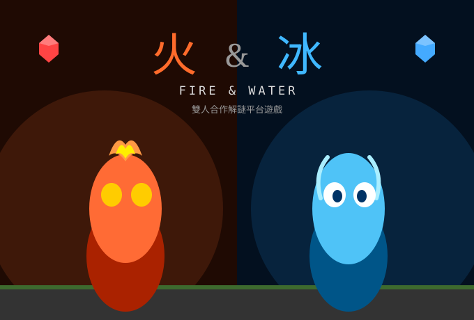
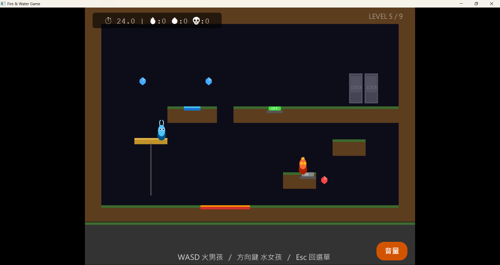

<div align="center">

# 🔥❄️ 冰與火遊戲 (Fire & Ice)

**雙人合作解謎平台跳躍遊戲 — 用 JavaFX 打造**

[]()
[]()
[]()
[]()

</div>

---

## 📖 專案簡介

這是一款靈感源自《Fireboy and Watergirl》的雙人合作解謎平台遊戲，採用 Java 21 與 JavaFX 開發。遊戲中兩名玩家分別操控「火」與「水」兩位角色，必須密切配合觸發機關、開啟通道並收集寶石，最終合力通關。

本項目改編自大一期末小組專題。我的分工項目為完整的 遊戲迴圈（Game Loop）、2D 碰撞偵測與物理系統、關卡管理機制，以及 主選單與關卡選擇介面。

<div align="center">
  
</div>

---

## ✨ 功能特色

- 🎮 **雙人本機合作**:兩人共用一個鍵盤,分別操控火與水角色
- ⚙️ **自製物理系統**:重力、跳躍、摩擦力、地面偵測皆為手刻實作(`Physics.java`)
- 🧩 **互動機關**:按鈕(Button)、門(Door)、電梯(Elevator)等機關需要雙人協力觸發
- 💎 **寶石收集與關卡管理**:透過 `LevelManager` 管理多個關卡的載入與切換
- 🖥️ **完整選單流程**:標題畫面(TitleScreen)→ 關卡選擇(LevelSelectScreen)→ 遊戲畫面
- 🎵 **背景音樂系統**:自製 `BGM` 類別控制音樂播放

<div align="center">
  
  <br>
  <sub>📸 遊戲實際畫面(第 5 關):可以看到寶石收集、電梯開關(ON/OFF)、上鎖的門(LOCK)等機關</sub>
</div>

---

## 🛠️ 技術細節

| 類別 | 使用技術 |
|------|----------|
| 語言 | Java 21 |
| 遊戲引擎/UI | JavaFX (controls, fxml, media) |
| 建置工具 | Maven |
| 測試框架 | JUnit 5 |
| IDE | IntelliJ IDEA |

**專案架構**
```
com.example.final_project
├── GameApp.java          # 主應用程式入口與畫面切換
├── GameLoop.java          # 核心遊戲迴圈(AnimationTimer,逐幀更新畫面)
├── GameWorld.java         # 遊戲世界狀態管理
├── InputHandler.java      # 鍵盤輸入處理(火:WASD / 水:方向鍵)
├── TitleScreen.java       # 標題畫面
├── LevelSelectScreen.java # 關卡選擇畫面
├── entity/
│   └── Player.java        # 玩家角色(火/水共用邏輯)
└── world/
    ├── Level.java          # 單一關卡資料結構
    ├── LevelManager.java   # 關卡載入與管理
    ├── Physics.java        # 碰撞偵測與物理運算
    ├── Tile.java           # 地圖磁磚
    ├── Button.java         # 機關按鈕
    ├── Door.java           # 機關門
    ├── Elevator.java       # 電梯機關
    └── Gem.java            # 收集寶石
```

---

## ⚙️ 安裝與執行方式

**前置需求**
- JDK 21 或以上
- Maven(專案已附帶 `mvnw` / `mvnw.cmd`,不需另外安裝 Maven)

```bash
# 1. Clone 專案
git clone https://github.com/bubugugu/ice-fire-game.git
cd ice-fire-game

# 2. 使用 Maven Wrapper 執行遊戲(Windows)
mvnw.cmd clean javafx:run

# 或(Mac / Linux)
./mvnw clean javafx:run
```

---

## 🎮 操作方式

| 角色 | 左移 | 右移 | 跳躍 |
|------|------|------|------|
| 🔥 火 (Fire) | `A` | `D` | `W` |
| ❄️ 水 (Water) | `←` | `→` | `↑` |

雙人在同一台電腦、同一個鍵盤上合作遊玩。

---

## 💡 開發心得與挑戰

- **遇到的問題**:雙人角色的物理碰撞與地圖磁磚偵測一開始容易出現「卡牆」或「穿模」問題
- **怎麼解決的**:把碰撞判斷拆到獨立的 `Physics` 類別,依 X 軸、Y 軸分開處理,並用每幀的 `dt`(時間差)做速度平滑控制,解決了移動不穩定的問題
- **機關連動的設計**:按鈕、門、電梯這幾個機關原本各自獨立處理容易產生耦合,後來統一透過 `world` 套件的物件狀態溝通,讓 `LevelManager` 能一次管理所有機關互動

---

## 🗺️ 未來規劃

- [ ] 加入更多關卡與機關類型
- [ ] 加入計時挑戰模式
- [ ] 補上遊戲畫面截圖 / 遊玩 GIF

---

## 👤 作者

**黃宥翔 (bubugugu)**

- GitHub: [@bubugugu](https://github.com/bubugugu)

</div>
